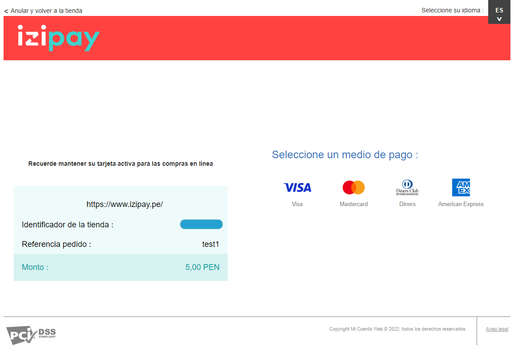

# [Redirect-PaymentForm-Php]

## Índice

- [1. Introducción](#1-introducción)
- [2. Requisitos previos](#2-requisitos-previos)
- [3. Despliegue](#3-despliegue)
- [4. Datos de conexión](#4-datos-de-conexión)
- [5. Transacción de prueba](#5-transacción-de-prueba)
- [6. Implementación de la IPN](#6-implementación-de-la-ipn)
- [7. Personalización](#7-personalización)
- [8. Consideraciones](#8-consideraciones)

## 1. Introducción

En este manual podrás encontrar una guía paso a paso para configurar un proyecto de **[PHP]** con la pasarela de pagos de IZIPAY. Te proporcionaremos instrucciones detalladas y credenciales de prueba para la instalación y configuración del proyecto, permitiéndote trabajar y experimentar de manera segura en tu propio entorno local.
Este manual está diseñado para ayudarte a comprender el flujo de la integración de la pasarela para ayudarte a aprovechar al máximo tu proyecto y facilitar tu experiencia de desarrollo.

<p align="center">
  
</p>

<a name="Requisitos_Previos"></a>

## 2. Requisitos previos

- Comprender el flujo de comunicación de la pasarela. [Información Aquí](https://secure.micuentaweb.pe/doc/es-PE/rest/V4.0/javascript/guide/start.html)
- Extraer credenciales del Back Office Vendedor. [Guía Aquí](https://github.com/izipay-pe/obtener-credenciales-de-conexion)
- Instalar XAMPP [Aquí](https://www.apachefriends.org/es/index.html)
- PHP 7.0 o supior
- Servidor Web
- Para este proyecto utilizamos la herramienta Visual Studio Code.
  > [!NOTE]
  > Tener en cuenta que, para que el desarrollo de tu proyecto, eres libre de emplear tus herramientas preferidas.

## 3. Despliegue

### Instalar Live Server

Para este ejemplo se utilizó el servidor gratuito de [000webhost](https://www.000webhost.com/), ingrese a su cuenta de [000webhost](https://www.000webhost.com/) y siga los siguientes pasos.

- **Paso 1:** Crearse un nuevo sitio.

  

- **Paso 2:** Crear una URL pública y generar una contraseña de acceso a su sitio.

  

- **Paso 3:** Seleccionar File Manager para subir el proyecto.

  

- **Paso 4:** Seleccionar la carpeta `public_html` y subir los archivos del proyecto .zip

  ```sh
  index.php
  infoPayment.php
  pagoFinalizado.php
  example.configKey.php
  css/style.css
  ```

  

  Ver el resultado en: https://tusitio.000webhostapp.com

### Clonar el proyecto:

```sh
git clone [https://github.com/izipay-pe/Redirect-PaymentForm-Php.git]
```

### Ejecutar proyecto

- Paso 1.- Mover el proyecto y descomprimirlo en la carpeta htdocs en la ruta de instalación de Xampp: `C:\xampp\htdocs`

  

- Paso 2.- Abrir la aplicación XAMPP Control Panel y ejecutar el botón **Start** del modulo de **Apache**, quedando de la siguiente manera:

  

- Paso 3.- Abrir el navegador web (Chrome, Mozilla, Safari, etc): **http://localhost:80/Redirect-PaymentForm-PHP/** y realizar una compra de prueba.

  

- **Error: PaymentFormError = 02 vads_side_id**, este error saldrá porque no se tiene configurado las credenciales de integración en el archivo **./example.configKey.php** .  
  Estas mismas credenciales se encuentran en su [Back Office Vendedor de Izipay](https://secure.micuentaweb.pe/vads-merchant/) en la siguiente ruta: **Configuracion - Tienda - Claves**  
  Más información [Ver requisitos previos](#Requisitos_Previos).

  

## 4. Datos de conexión

**Nota**: Reemplace **[CHANGE_ME]** con sus credenciales de `CLAVES` extraídas desde el Back Office Vendedor, ver [Requisitos Previos](#Requisitos_Previos).

- Editar en `example.configKey.php`:

  ```sh
  //Identificador de su tienda
  $_SHOP_ID = "**[CHANGE_ME]**";

  //Clave de TEST O PRODUCCIÖN de su tienda.
  $_KEY = "**[CHANGE_ME]**";

  //URL del servidor de Izipay
  $_URL_IZIPAY = "https://secure.micuentaweb.pe/vads-payment/";
  ```

## 5. Transacción de prueba

Antes de poner en marcha su pasarela de pago en un entorno de producción, es esencial realizar pruebas para garantizar su correcto funcionamiento.

Puede intentar realizar una transacción utilizando una tarjeta de prueba con la barra de herramientas de depuración (en la parte inferior de la página).

<p align="center">
  
</p>

- También puede encontrar tarjetas de prueba en el siguiente enlace. [Tarjetas de prueba](https://secure.micuentaweb.pe/doc/es-PE/rest/V4.0/api/kb/test_cards.html)

## 6. Implementación de la IPN

> [!IMPORTANT]
> Es recomendable implementar la IPN para comunicar el resultado de la solicitud de pago al servidor del comercio.

La IPN es una notificación de servidor a servidor (servidor de Izipay hacia el servidor del comercio) que facilita información en tiempo real y de manera automática cuando se produce un evento, por ejemplo, al registrar una transacción.
Los datos transmitidos en la IPN se reciben y analizan mediante un script que el vendedor habrá desarrollado en su servidor.

- Ver manual de implementación de la IPN. [Aquí](https://secure.micuentaweb.pe/doc/es-PE/rest/V4.0/kb/payment_done.html)
- Vea el ejemplo de la respuesta IPN con PHP. [Aquí](https://github.com/izipay-pe/Redirect-PaymentForm-IpnT1-PHP)
- Vea el ejemplo de la respuesta IPN con NODE.JS. [Aquí](https://github.com/izipay-pe/Response-PaymentFormT1-Ipn)

## 7. Personalización

Si deseas aplicar cambios específicos en la apariencia de la pasarela de pago, puedes lograrlo mediante la modificación de código CSS. En este enlace [Código CSS - Incrustado](https://github.com/izipay-pe/Personalizacion-PaymentForm-Incrustado) podrá encontrar nuestro script para un formulario incrustado.

## 8. Consideraciones

Para obtener más información, echa un vistazo a:

- [Formulario incrustado: prueba rápida](https://secure.micuentaweb.pe/doc/es-PE/rest/V4.0/javascript/quick_start_js.html)
- [Primeros pasos: pago simple](https://secure.micuentaweb.pe/doc/es-PE/rest/V4.0/javascript/guide/start.html)
- [Servicios web - referencia de la API REST](https://secure.micuentaweb.pe/doc/es-PE/rest/V4.0/api/reference.html)
